# software_architecture_task1

POST requests 1 for facade service: 
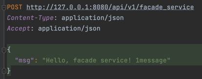

Response: 
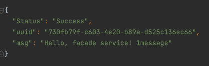

Logging: 
Facade service logs: 
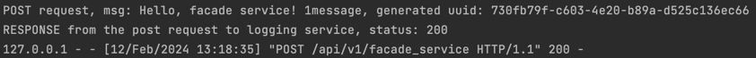

Logging service logs: 
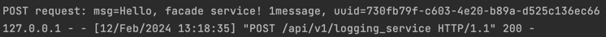

Post requests 2 for facade service: 
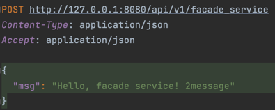

Response: 
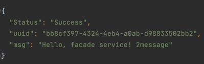

Get request for facade service: 
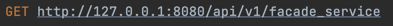

Response: 
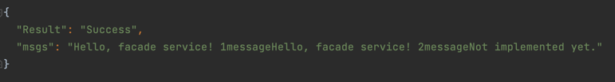

Logging: 
Facade service logs: 
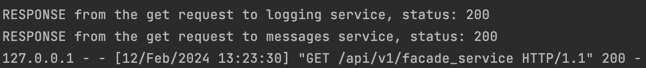

Logging service logs: 
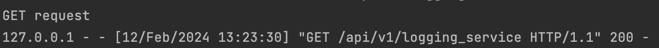

Messages service logs: 
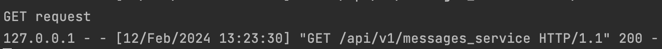

