# software_architecture_task1

In order to launch services you should run following commands in the root directory of the project:
```bash
python3 -m facade_service.main
python3 -m messages_service.main
python3 -m logging_service.main
```

POST requests 1 for facade service:<br>
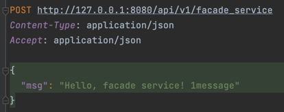

Response:<br>
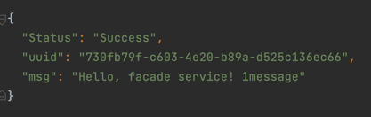

Logging:<br>
Facade service logs:<br>
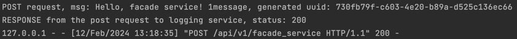

Logging service logs:<br>
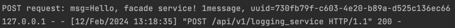

Post requests 2 for facade service:<br>
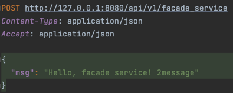

Response:<br>
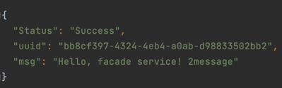

Get request for facade service:<br>
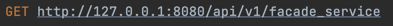

Response:<br>
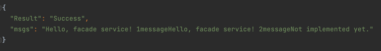

Logging:<br>
Facade service logs:<br>
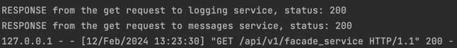

Logging service logs:<br>
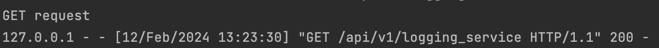

Messages service logs:<br>
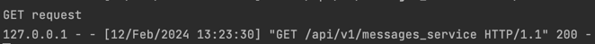

